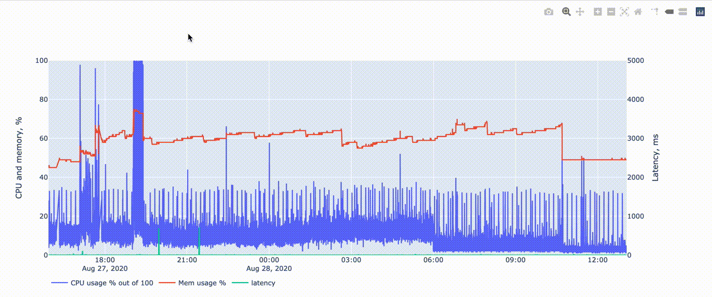

# stabmon

`stabmon` helps pinpoint server stability issues.

1. **Tracks which processes used the most CPU or memory in the past.**
2. Tracks system CPU, memory and **network latency**.
3. Draws interactive graphs in a browser.
4. Cross-platform

Instability and transient bugs are the worst. Have you ever asked yourself:
- Why does my home streaming server drops connections sometimes? Is it load, memory or bad ethernet adapter drivers?
- There is enough memory, why does my server crash in the middle of the night?
- Does my VPN freeze? Or is it WiFi adapter? Or is it my provider? 



### Why one more tool
There are many tools that track system CPU and memory, but only `atop` seems to answer a question "**which process** caused a CPU/memory spike".

Problems with `atop`:
- `atop` logs are hard to explore if you don't know when the problem happened - `atop` itself doesn't provide graphs to visually identify spikes
- Even if you have resource graphs (e.g. from `munin`) - it is tedious to jump from graphs to `atop` logs for every spike (look at the gif below - there can be many spikes)
- `atop` is Linux-only

**Great idea would be integrating this project with** [aplot](https://github.com/efenka/aplot), graphing solution for `atop`.

`aplot` could benefit from:
- adding interactive graphs instead of "ancient" gnuplot
- adding graph labels on what process used the most CPU
- it doesn't check network latency though

But like all great ideas this one came too late, after I already wrote `stabmon`

### Usage

#### Requirements
- Mac, Linux, Windows
- Python 3
- pip

#### Installation

```
# Download/unzip or clone code from GitHub
git clone git@github.com:zhogov/stabmon.git
cd ./stabmon
# Install required Python 3 packages using pip
pip3 install -r requirements.txt
``` 

#### Collect logs
Start log collection (logs will be saved to `stabmon.csv`)
```
./stabmon_collect.py
```

Arguments:
```
./stabmon_collect.py --help
usage: stabmon_collect.py [-h] [--log LOG] [--url URL] [--interval INTERVAL]

Log CPU, memory and network latency to CSV.

optional arguments:
  -h, --help           show this help message and exit
  --log LOG            Log file location, defaults to "stabmon.csv"
  --url URL            URL for network availability check. HTTP HEAD request will be issued. Use your router's favicon (e.g. http://192.168.1.1/favicon.ico). Defaults to http://google.com
  --interval INTERVAL  Interval for resource usage checking, seconds. Defaults to 1 seconds
```

#### Draw graphs

Run the following command and open http://127.0.0.1:8050/ in your browser
```
./stabmon_graph.py
```

Use `--log` argument to set log file location, it can be URL (collecting on server but graphing on your laptop):
```
./stabmon_graph.py --log=http://myserver/logfile
```

Arguments:
```
./stabmon_graph.py --help           
usage: stabmon_graph.py [-h] [--log LOG]

Draw graph based on CSV log file.

optional arguments:
  -h, --help  show this help message and exit
  --log LOG   Log file location, defaults to "stabmon.csv"
```